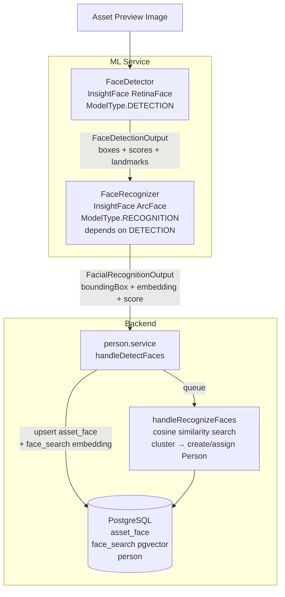
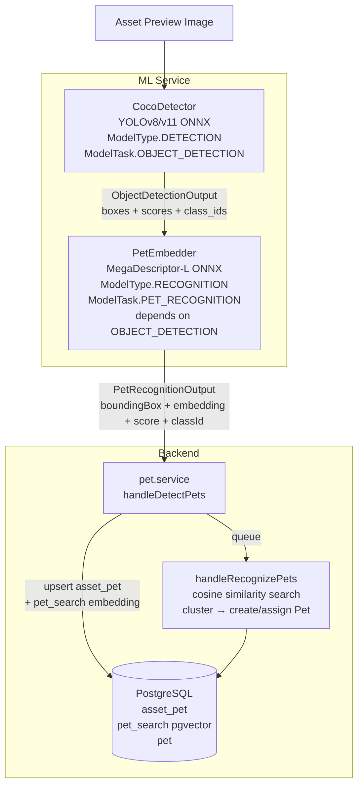
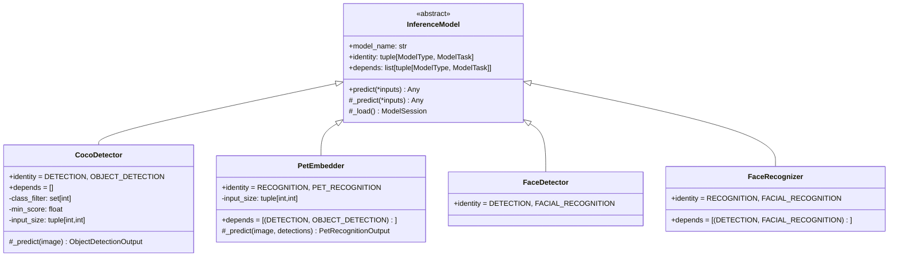
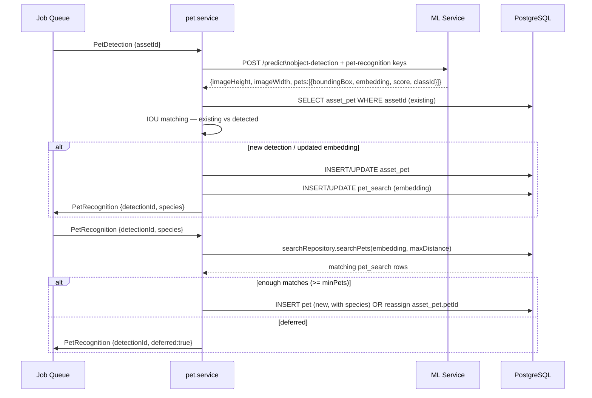

# Pet Identification — Design Document

---

## User Experience

This section is the authoritative UX specification for the pet recognition feature. It contains two inventories: first an exhaustive description of every screen and interaction in the existing **People** feature, then the target **Pets** specification derived from it. The implementation status of each Pets item is tracked separately in the [Implementation Status](#implementation-status) section at the bottom of this document.

---

### People feature inventory

#### Gallery page — `/people`

| ID | Feature | Behaviour |
|----|---------|-----------|
| P-G1 | Infinite scroll grid | Paginated grid of person cards. Scroll position and all previously loaded pages are restored when the user navigates back from a detail page. |
| P-G2 | Server-side search | Search bar at the top; queries `GET /people?name=` via the `SearchPeople` component. Results update as the user types. The search term is written to the URL (`?searched_people=`) so it survives navigation and can be linked to. |
| P-G3 | Inline name editing | Each card has a text input below the thumbnail. Clicking it focuses the field; blurring (or pressing Enter) saves the new name via `updatePerson`. If the name already belongs to another person, the merge suggestion flow is triggered (P-G4). |
| P-G4 | Merge suggestion on name collision | After saving a name, the client calls `searchPerson` server-side. If a person with exactly that name already exists, `PersonMergeSuggestionModal` is shown, asking whether to merge the two into one. |
| P-G5 | Hide | Three-dot card menu → Hide; calls `updatePerson({ isHidden: true })`; card disappears from the visible grid immediately. |
| P-G6 | Favorite / unfavorite | Three-dot card menu; toggles `isFavorite` and shows a toast. |
| P-G7 | Merge (from gallery) | Three-dot card menu → Merge; navigates to the person detail page with `?action=merge`, which opens the merge selector immediately. |
| P-G8 | Show & hide link | Button in the page header; links to `/people/manage`. |
| P-G9 | Live thumbnail update | Websocket event `on_person_thumbnail` triggers a cache-busted thumbnail reload for the matching card without a full page refresh. |
| P-G10 | Empty states | No people: person-off icon + "No people found". Search with no results: "No people named {name}". |

#### Manage page — `/people/manage`

| ID | Feature | Behaviour |
|----|---------|-----------|
| P-M1 | Bulk visibility toggle | A single icon button cycles through three states: Show All → Hide Unnamed → Hide All. Each transition applies the appropriate hidden state to every person held in memory as a pending change. |
| P-M2 | Per-person toggle | Clicking any thumbnail flips its hidden state as a pending change (visible immediately in the UI, not yet saved). |
| P-M3 | Reset pending changes | Icon button discards all in-memory pending changes and reverts the page to the last saved state. |
| P-M4 | Save (Done) | Commits all pending changes via the `updatePeople` bulk API; shows a success/failure toast; navigates back to `/people`. |
| P-M5 | Infinite scroll | Loads additional pages of people as the user scrolls to the bottom of the manage page. |
| P-M6 | Name overlay | Each thumbnail on the manage page shows the person's name as an overlay, so the user can identify unnamed vs named people at a glance. |

#### Detail page — `/people/[id]`

| ID | Feature | Behaviour |
|----|---------|-----------|
| P-D1 | Asset timeline | Full-screen infinite timeline of all assets containing this person, filtered via `personId` in `getTimeBuckets` / `getTimeBucket`. |
| P-D2 | Inline name editing with autocomplete | Click the profile area (thumbnail or name) to enter edit mode. As the user types, `searchPerson` is called server-side and matching people appear as a dropdown list below the input. Selecting a suggestion from the dropdown triggers the merge suggestion modal. |
| P-D3 | Birth date display | If a birth date is set, it is shown below the asset count in the header. |
| P-D4 | Asset count | Total assets for this person, updated live when assets are added or removed. |
| P-D5 | Back navigation | Back arrow in the app bar returns to wherever the user navigated from, determined by `afterNavigate` and the `?previous_route=` query parameter. |
| P-D6 | Select featured photo | Context menu item; enters single-select mode on the timeline. Clicking any asset calls `updatePerson({ featureFaceAssetId })` and returns to normal view. |
| P-D7 | Hide / Unhide | Context menu items; call `updatePerson({ isHidden })`; if hidden, the user is navigated back to the previous route. |
| P-D8 | Set date of birth | Context menu item; opens a date-picker modal; saves to `person.birthDate`. |
| P-D9 | Merge | Context menu item; enters `MERGE_PEOPLE` view mode, rendering `MergeFaceSelector`. |
| P-D10 | Favorite / Unfavorite | Context menu items; toggle `isFavorite`. |
| P-D11 | Live thumbnail update | Websocket `on_person_thumbnail` event cache-busts the profile thumbnail on this page. |
| P-D12 | Multi-select bulk actions | Long-press or checkbox to enter multi-select mode; action bar offers: Select All, Add to Album, Favorite, Download (zip named after the person), Fix incorrect match, Change Date / Description / Location, Archive, Tag, Set Visibility, Delete with undo. |

#### Merge selector — `MergeFaceSelector`

| ID | Feature | Behaviour |
|----|---------|-----------|
| P-MS1 | Similarity-sorted list | The candidate list is loaded via `getAllPeople({ closestPersonId })`, which returns people sorted by embedding similarity to the current person — the most likely merge targets appear first. |
| P-MS2 | Multi-select up to 5 | Up to 5 people can be selected for a single merge operation; a warning toast is shown if the limit is exceeded. |
| P-MS3 | Swap direction | When exactly one person is selected, a swap button appears. Pressing it navigates to the other person's detail page with `?action=merge`, reversing who absorbs whom. |
| P-MS4 | Auto-swap on name | If the selected person has a name and the current person doesn't, the swap happens automatically when the first person is selected. |
| P-MS5 | Confirm dialog | A modal confirmation is shown before the merge is executed. |
| P-MS6 | Success toast | "Merged N people" toast is shown after a successful merge. |

#### Fix incorrect match — `UnmergeFaceSelector`

| ID | Feature | Behaviour |
|----|---------|-----------|
| P-UM1 | Create new person | "Create new person" button (disabled when a person is already selected). Creates a blank `Person` entity via `createPerson`, then calls `reassignFaces` to move the selected assets to it. |
| P-UM2 | Reassign to existing | Select a person from the list then press "Reassign"; calls `reassignFaces` with `{ assetId, personId }` tuples for all selected assets. |
| P-UM3 | Current person excluded | The person whose timeline the user started from is not shown in the candidate list. |

#### Asset info panel — People section

| ID | Feature | Behaviour |
|----|---------|-----------|
| P-I1 | Thumbnail grid | Recognised people shown as a grid of circular thumbnails. Up to 6 → 3 columns; 7 or more → 4 columns. Each thumbnail links to the person's detail page. |
| P-I2 | Age display | If the person has a birth date, the age at the time the photo was taken is shown below their name in the grid. |
| P-I3 | Hidden people toggle | If any person in the photo is hidden, an eye icon button appears next to the section title; clicking it temporarily reveals all hidden people in the grid. |
| P-I4 | Bounding box highlight on hover | Hovering over any thumbnail highlights that person's face bounding box overlaid on the photo. |
| P-I5 | "+" button — draw and tag | Opens `FaceEditor`: a Fabric.js canvas overlaid on the photo. The user draws a bounding-box rectangle, then either assigns it to an existing person (from a search-filtered list) or creates a new person (name prompt → `createPerson` + `createFace`). |
| P-I6 | Pencil button — edit detections | Opens `PersonSidePanel`; visible only when the asset has people or unassigned face detections. |

#### PersonSidePanel — edit detections

| ID | Feature | Behaviour |
|----|---------|-----------|
| P-SP1 | Detection thumbnail grid | 90 px tiles for each detection. Assigned detection: shows the person's profile thumbnail. Unassigned detection: shows a bounding-box crop of the face extracted from the photo using `zoomImageToBase64`. |
| P-SP2 | Bounding box highlight on hover | Hovering over a tile highlights that detection's bounding box on the photo. |
| P-SP3 | Pencil button per detection | Opens `AssignFaceSidePanel` as an overlay panel, scoped to that detection. |
| P-SP4 | Trash button per assigned detection | Confirm dialog, then calls `deleteFace`; the detection tile disappears and the asset viewer refreshes. |
| P-SP5 | Reset staged change | When a reassignment is staged but not yet saved, a reset button replaces the pencil button; clicking it discards the pending change. |
| P-SP6 | Staged changes + Done | Changes are held in memory. Pressing "Done" commits all pending reassignments via `reassignFacesById` and shows a "N edits saved" toast. |
| P-SP7 | Escape handling | Pressing Escape closes the picker overlay if open; a second Escape closes the side panel. |

#### AssignFaceSidePanel — person picker

| ID | Feature | Behaviour |
|----|---------|-----------|
| P-AP1 | Similarity-sorted grid | Loads via `getAllPeople({ closestAssetId: detectionId })`; people most visually similar to the detection appear first. |
| P-AP2 | Server-side search | Magnifying glass button enters search mode; input queries the `SearchPeople` server component. |
| P-AP3 | Excludes current assignment | If the detection is already assigned to a person, that person is not shown in the picker. |
| P-AP4 | Create new person | "+" icon button; crops the detection using `zoomImageToBase64`, creates a blank person, and queues the crop as the feature photo. |

---

### Pets feature inventory

The following is the target specification for the Pets feature. Each item is derived from the People inventory above. Items marked **N/A** are genuinely inapplicable to pets; items marked **ADAPTED** describe how the equivalent behaviour differs for pets.

#### Gallery page — `/pets`

| ID | Feature | Target behaviour |
|----|---------|-----------------|
| PET-G1 | Infinite scroll grid | Same as P-G1. Paginated grid of pet cards; scroll position and previously loaded pages restored on back-navigation. |
| PET-G2 | Server-side search | Same as P-G2. Search bar at the top queries `GET /pets?name=` and persists the term in the URL. |
| PET-G3 | Inline name editing | Same as P-G3. Text input below each card; blur or Enter saves; triggers merge suggestion if the name already exists (PET-G4). |
| PET-G4 | Merge suggestion on name collision | Same as P-G4. After saving a name, call `searchPets` server-side; if an exact match exists, show a merge suggestion modal. |
| PET-G5 | Hide | Same as P-G5. Three-dot menu → Hide; calls `updatePet({ isHidden: true })`; card disappears immediately. |
| PET-G6 | Favorite / unfavorite | Same as P-G6. Three-dot menu; shows toast. |
| PET-G7 | Merge (from gallery) | Same as P-G7. Three-dot menu → Merge; navigates to pet detail with `?action=merge`. |
| PET-G8 | Show & hide link | Same as P-G8. Button links to `/pets/manage`. |
| PET-G9 | Live thumbnail update | Same as P-G9. Websocket event cache-busts the matching card thumbnail. |
| PET-G10 | Empty states | ADAPTED. No pets: paw-off icon + "No pets found". Search with no results: "No pets named {name}". |

#### Manage page — `/pets/manage`

| ID | Feature | Target behaviour |
|----|---------|-----------------|
| PET-M1 | Bulk visibility toggle | Same as P-M1. Cycles Show All → Hide Unnamed → Hide All. |
| PET-M2 | Per-pet toggle | Same as P-M2. Clicking any thumbnail flips its hidden state as a pending change. |
| PET-M3 | Reset pending changes | Same as P-M3. |
| PET-M4 | Save (Done) | Same as P-M4. Commits via `updatePets` bulk call; navigates back to `/pets`. |
| PET-M5 | Infinite scroll | Same as P-M5. |
| PET-M6 | Name overlay | Same as P-M6. Shows the pet's name overlaid on the thumbnail. |

#### Detail page — `/pets/[id]`

| ID | Feature | Target behaviour |
|----|---------|-----------------|
| PET-D1 | Asset timeline | Same as P-D1. Full-screen timeline filtered by `petId`. |
| PET-D2 | Inline name editing with autocomplete | Same as P-D2. Typing calls `searchPets` server-side; matching pets appear as a dropdown; selecting one triggers merge suggestion. |
| PET-D3 | Birth date | N/A. Not applicable to pets. |
| PET-D4 | Asset count | Same as P-D4. |
| PET-D5 | Species label | ADAPTED. The ML-derived species (cat, dog, etc.) is shown below the asset count; it is read-only and cannot be edited. |
| PET-D6 | Back navigation | Same as P-D5. |
| PET-D7 | Select featured photo | Same as P-D6. Single-select mode; clicking an asset calls `updatePet({ thumbnailAssetId })`. |
| PET-D8 | Hide / Unhide | Same as P-D7. |
| PET-D9 | Set date of birth | N/A. Not applicable to pets. |
| PET-D10 | Merge | Same as P-D9. Context menu → Merge; renders `MergePetSelector`. |
| PET-D11 | Favorite / Unfavorite | Same as P-D10. |
| PET-D12 | Live thumbnail update | Same as P-D11. |
| PET-D13 | Multi-select bulk actions | Same as P-D12. Same full action set. |

#### Merge selector — `MergePetSelector`

| ID | Feature | Target behaviour |
|----|---------|-----------------|
| PET-MS1 | Similarity-sorted list | Loads via `getAllPets({ closestPetId })` so the most visually similar pets appear first. |
| PET-MS2 | Multi-select up to 5 | Same as P-MS2. |
| PET-MS3 | Swap direction | Same as P-MS3. |
| PET-MS4 | Auto-swap on name | Same as P-MS4. |
| PET-MS5 | Confirm dialog | Same as P-MS5. |
| PET-MS6 | Success toast | Same as P-MS6. |

#### Fix incorrect match — `ReassignPetDetectionSelector`

| ID | Feature | Target behaviour |
|----|---------|-----------------|
| PET-UM1 | Create new pet | ADAPTED. "Create new pet" button creates a blank `Pet` entity via `createPet`, then calls `reassignPetDetections` to move the selected assets to it. |
| PET-UM2 | Reassign to existing pet | Same as P-UM2. Pick from the list; calls `reassignPetDetections`. |
| PET-UM3 | Current pet excluded | Same as P-UM3. |

#### Asset info panel — Pets section

| ID | Feature | Target behaviour |
|----|---------|-----------------|
| PET-I1 | Thumbnail grid | Same grid layout as P-I1. Circular thumbnails link to the pet's detail page. |
| PET-I2 | Age display | N/A. Not applicable to pets. |
| PET-I3 | Hidden pets toggle | Same as P-I3. Eye button appears if any pet in the photo is hidden; reveals them temporarily. |
| PET-I4 | Bounding box highlight on hover | Same as P-I4. |
| PET-I5 | "+" button — draw and tag | ADAPTED. Opens a canvas-based draw-and-tag tool analogous to `FaceEditor`. The user draws a bounding box on the photo, then assigns it to an existing pet (from a search-filtered list) or creates a new pet entity. |
| PET-I6 | Pencil button — edit detections | Same as P-I6. Opens `PetSidePanel`; visible when the asset has pets or unassigned detections. |

#### PetSidePanel — edit detections

| ID | Feature | Target behaviour |
|----|---------|-----------------|
| PET-SP1 | Detection thumbnail grid | Same as P-SP1. 90 px tiles. Assigned → pet profile thumbnail. Unassigned → bounding-box crop from the photo. |
| PET-SP2 | Bounding box highlight on hover | Same as P-SP2. |
| PET-SP3 | Pencil button per detection | Opens `AssignPetSidePanel` overlay. |
| PET-SP4 | Trash button per assigned detection | Same as P-SP4. Confirm dialog + `deletePetDetection`. |
| PET-SP5 | Reset staged change | Same as P-SP5. |
| PET-SP6 | Staged changes + Done | Same as P-SP6. Commits via `reassignPetDetection`. |
| PET-SP7 | Escape handling | Same as P-SP7. |

#### AssignPetSidePanel — pet picker

| ID | Feature | Target behaviour |
|----|---------|-----------------|
| PET-AP1 | Similarity-sorted grid | Loads via `getAllPets({ closestAssetId: detectionId })`; pets most visually similar to the detection appear first. |
| PET-AP2 | Server-side search | Same as P-AP2. Search input queries the server. |
| PET-AP3 | Excludes current assignment | Same as P-AP3. |
| PET-AP4 | Create new pet | ADAPTED. "+" button creates a blank `Pet` entity and stages it as the reassignment for this detection. No feature-photo crop is needed since pets have ML-generated thumbnails. |

---

## Technical Design

### Overview

Pet identification is modelled on the existing face identification pipeline. The key difference is that no single end-to-end model (like InsightFace's `buffalo_l`) exists for pets, so the pipeline is split into two explicit stages:

1. **Detection** — YOLO via a `CocoDetector` class (generic COCO-taxonomy object detector)
2. **Re-identification** — MegaDescriptor (crop-level embeddings for animal re-ID)

Both stages run as ONNX sessions inside the existing ML service. The `CocoDetector` is intentionally generic (not pet-specific) so it can be reused for future tasks (vehicle detection, scene tagging, etc.).

---

### Current Face Pipeline (Reference)



**Key facts carried forward:**
- Detection and recognition are separate `InferenceModel` subclasses with a `depends` list.
- The `/predict` endpoint receives a single image and a JSON `entries` map keyed by task.
- Embeddings are stored as `VECTOR(512)` in a dedicated table with an HNSW index.
- Clustering is done in the backend via pgvector cosine search, not in the ML service.

---

### Proposed Pet Pipeline



---

### ML Service Changes

#### Model Tasks

```python
# immich_ml/schemas.py  (addition to existing ModelTask enum)
class ModelTask(StrEnum):
    FACIAL_RECOGNITION = "facial-recognition"
    SEARCH             = "clip"
    OCR                = "ocr"
    OBJECT_DETECTION   = "object-detection"   # NEW — generic COCO detector
    PET_RECOGNITION    = "pet-recognition"    # NEW — crop re-ID
```

`OBJECT_DETECTION` is a standalone first-class task, not nested inside `PET_RECOGNITION`. Future re-ID tasks (vehicles, wildlife, etc.) simply declare `depends = [(DETECTION, OBJECT_DETECTION)]` and the ML service's dependency resolver runs the detector once, sharing its output across all dependent tasks in the same request.

#### Class Hierarchy



#### New Schema Types

```python
# immich_ml/schemas.py  (additions)

class ObjectDetectionOutput(TypedDict):
    boxes:     npt.NDArray[np.float32]   # shape [N, 4]  x1y1x2y2 in pixel coords
    scores:    npt.NDArray[np.float32]   # shape [N]
    class_ids: npt.NDArray[np.int32]     # shape [N]  COCO class index

class DetectedPet(TypedDict):
    boundingBox: BoundingBox
    embedding:   str                     # serialised float32 array
    score:       float
    classId:     int                     # COCO class id — mapped to species server-side

PetRecognitionOutput = list[DetectedPet]
```

#### `CocoDetector` — implementation notes

| Concern | Decision |
|---------|-----------|
| Model | `yolov8m.onnx` or `yolo11m.onnx` from Ultralytics (MIT licence). Export via `ultralytics export model=yolov8m.pt format=onnx`. |
| Input | Resize + letterbox to 640×640, normalise to [0,1], BCHW float32. |
| Output | YOLOv8 ONNX raw output: `[1, 84, 8400]`. Transpose, split class/box heads, apply `class_filter` to keep only desired class ids, NMS. |
| NMS | Pure NumPy / SciPy; no torchvision dependency. |
| `class_filter` | Passed as a constructor kwarg and settable via `configure()`. Defaults to `None` (all 80 COCO classes). For pets: `{15..23}` (all COCO animals). |
| HuggingFace repo | `Ultralytics/assets` or mirror a quantised export to `immich-ml/yolov8m-onnx`. |

#### `PetEmbedder` — implementation notes

| Concern | Decision |
|---------|-----------|
| Model | `BVRA/MegaDescriptor-L-384` (timm, Apache-2.0). Export once to ONNX via `torch.onnx.export` at 384×384 input. Host on HuggingFace as `immich-ml/megadescriptor-l-384-onnx`. |
| Input | Crop bounding box from original image (with small padding), resize to 384×384, normalise with ImageNet stats, BCHW float32. |
| Output | `[N, 1536]` L2-normalised embedding per crop. |
| Embedding dim | 1536. Stored in pgvector `VECTOR(1536)`. |
| Batching | Same batched ONNX call pattern as `FaceRecognizer`. |

> **Licence:** MegaDescriptor-L-384 is CC-BY-NC 4.0 (non-commercial). This mirrors InsightFace (`buffalo_l`), which Immich already uses under the same restriction. Model weights are downloaded at runtime by the user and are not bundled in the Immich distribution.

#### `get_model_class` factory update

```python
# immich_ml/models/__init__.py
match (source, model_type, model_task):
    ...
    case (ModelSource.ULTRALYTICS, ModelType.DETECTION, ModelTask.OBJECT_DETECTION):
        return CocoDetector
    case (ModelSource.TIMM, ModelType.RECOGNITION, ModelTask.PET_RECOGNITION):
        return PetEmbedder
```

`ModelSource` gains two new values: `ULTRALYTICS` and `TIMM`.

Because the ML service resolves task dependencies before running each model, a single `/predict` request with both `object-detection` and `pet-recognition` keys will run `CocoDetector` first, then pass its `ObjectDetectionOutput` automatically to `PetEmbedder`. No special orchestration is needed server-side beyond including both task keys in the request.

---

### Backend Changes

#### Configuration

```typescript
// server/src/config.ts  (addition inside machineLearning)
petRecognition: {
  enabled:              boolean;   // default false
  detectionModelName:   string;    // "yolov8m"
  recognitionModelName: string;    // "MegaDescriptor-L-384"
  classFilter:          number[];  // [15..23]  all COCO animals
  minScore:             number;    // 0.1–1.0  default 0.6
  minPets:              number;    // cluster threshold  default 3
  maxDistance:          number;    // cosine distance  default 1.0
}
```

#### ML Repository

```typescript
// server/src/repositories/machine-learning.repository.ts
async detectPets(
  imagePath: string,
  detection: ObjectDetectionOptions,   // { modelName, minScore, classFilter }
  recognition: ModelOptions,           // { modelName }
): Promise<{ imageHeight: number; imageWidth: number; pets: DetectedPet[] }>
```

Request payload to ML service (two separate top-level task keys):

```json
{
  "object-detection": {
    "detection": {
      "modelName": "yolov8m",
      "options": { "minScore": 0.6, "classFilter": [15, 16, 17, 18, 19, 20, 21, 22, 23] }
    }
  },
  "pet-recognition": {
    "recognition": { "modelName": "MegaDescriptor-L-384" }
  }
}
```

#### Job Names

```typescript
// server/src/enum.ts
QueueName.PetDetection     = 'petDetection'
QueueName.PetRecognition   = 'petRecognition'

JobName.PetDetectionQueueAll
JobName.PetDetection
JobName.PetRecognitionQueueAll
JobName.PetRecognition
JobName.PetGenerateThumbnail
JobName.PetCleanup
```

#### Pet Service Pipeline



**Species handling:** `classId` from the ML output is mapped to a species string (`cocoClassToSpecies`, defined in `pet.service.ts`) at detection time and stored as `asset_pet.species`. It is also passed as `species?` in the `PetRecognition` job data and written to `pet.species` when a new `Pet` row is created. `asset_pet.species` is read-only (ML-derived); `pet.species` is the canonical user-facing species for the pet entity.

#### Database Schema

```mermaid
erDiagram
    asset ||--o{ asset_pet : "has"
    pet   ||--o{ asset_pet : "identified as"
    asset_pet ||--|| pet_search : "embedding"

    pet {
        uuid   id PK
        uuid   ownerId FK
        string name
        string species        "cat | dog | horse | ..."
        string thumbnailPath
        bool   isHidden
        bool   isFavorite
        string color          "nullable hex"
        uuid   thumbnailAssetId FK "nullable"
        ts     createdAt
        ts     updatedAt
    }

    asset_pet {
        uuid   id PK
        uuid   assetId  FK
        uuid   petId    FK "nullable"
        int    imageWidth
        int    imageHeight
        int    boundingBoxX1
        int    boundingBoxY1
        int    boundingBoxX2
        int    boundingBoxY2
        enum   sourceType "MachineLearning | Manual"
        string species   "ML-derived at detection time"
        bool   isVisible
        ts     deletedAt
        ts     updatedAt
    }

    pet_search {
        uuid   petId PK FK
        vector embedding "dim=1536 (MegaDescriptor)"
    }
```

**Indexes:**
- `pet_search(petId).embedding`: HNSW with `cosine_ops`, `ef_construction=300`, `m=16`
- `asset_pet(petId, assetId)`, `asset_pet(assetId, petId)`
- `pet.name` trigram GIN index (for search)

---

### `CocoDetector` Extension Points

```mermaid
flowchart LR
    CD[CocoDetector\nclass_filter=any]

    CD -->|classFilter={15..23}| PetPipeline[PetEmbedder\npet-recognition]
    CD -->|classFilter={2,3,5,7}| VehiclePipeline[VehicleEmbedder\nvehicle-recognition — future]
    CD -->|classFilter=None| ScenePipeline[Scene tagger — future]
```

Because `CocoDetector` is decoupled from `PetEmbedder`, other pipelines can reuse it without modification. The only coupling is the `ObjectDetectionOutput` type.

---

### ONNX Export Plan

| Model | Source | Export | Notes |
|-------|--------|--------|-------|
| YOLOv8m | `ultralytics/ultralytics` | `yolo export model=yolov8m.pt format=onnx opset=17` | Already produces static-shape ONNX. |
| MegaDescriptor-L-384 | `BVRA/MegaDescriptor-L-384` (timm) | `torch.onnx.export(model, dummy_384, opset_version=17, dynamic_axes={'input':{0:'batch'}})` | Needs `timm` + `torch`; one-time export script. Embedding dim: 1536. |

---

### Resolved Decisions

| # | Question | Decision |
|---|----------|----------|
| 1 | Embedding dimension | Use MegaDescriptor-L (1536 dims). |
| 2 | Species persistence | `asset_pet.species` is set from the ML-derived COCO class mapping at detection time and is read-only. It is also passed as `species?` in `PetRecognition` job data and written to `pet.species` when a new `Pet` row is created. |
| 3 | Detection classes | All 9 COCO animal classes: cat (15), dog (16), horse (17), sheep (18), cow (19), elephant (20), bear (21), zebra (22), giraffe (23). |
| 4 | Unified gallery | Pets and persons share one "People & Pets" gallery. Filter toggle: humans / animals / both. DB tables stay separate; API layer merges the two result sets. |
| 5 | Mixed assets | Both pipelines run independently as separate jobs — no conflict. An asset can have rows in both `asset_face` and `asset_pet`. |
| 6 | Thumbnail generation | Reuse the existing face thumbnail crop utility, parameterized by bounding box. |
| 7 | Single controller | All pet endpoints (CRUD + detection management) live in one `PetController`. No separate `FaceController` equivalent. |

---

### Implementation Plan

Each phase is a self-contained PR.

#### Phase 1 — ONNX model exports (offline, one-time)

| Step | Action |
|------|--------|
| 1.1 | Write `machine-learning/scripts/export_yolov8m.py` |
| 1.2 | Write `machine-learning/scripts/export_megadescriptor.py` |
| 1.3 | Run, smoke-test, upload to HuggingFace Hub. |

#### Phase 2 — ML service: `CocoDetector` + `PetEmbedder`

| Step | File | Action |
|------|------|--------|
| 2.1 | `immich_ml/schemas.py` | Add `ModelTask.OBJECT_DETECTION`, `ModelTask.PET_RECOGNITION`; add `ObjectDetectionOutput`, `DetectedPet`, `PetRecognitionOutput`. |
| 2.2 | `immich_ml/models/base.py` | Add `ModelSource.ULTRALYTICS`, `ModelSource.TIMM`. |
| 2.3 | `immich_ml/models/object_detection/detection.py` | Implement `CocoDetector`. |
| 2.4 | `immich_ml/models/pet_recognition/recognition.py` | Implement `PetEmbedder`. |
| 2.5 | `immich_ml/models/__init__.py` | Register both in factory. |
| 2.6 | `tests/` | Unit tests for both models. |

#### Phase 3 — Database migration

Mirror the exact decorator/import style of `person.table.ts`, `asset-face.table.ts`, `face-search.table.ts`.

| Step | File | Action |
|------|------|--------|
| 3.1 | `server/src/schema/tables/pet.table.ts` | `PetTable`: id, ownerId, name, species, thumbnailPath, isHidden, **isFavorite**, **color**, thumbnailAssetId, createdAt, updatedAt, updateId. Trigram GIN index on `f_unaccent(name)`. |
| 3.2 | `server/src/schema/tables/pet-audit.table.ts` | Mirror `person-audit.table.ts`. Wire `@AfterDeleteTrigger` on `PetTable`. |
| 3.3 | `server/src/schema/tables/asset-pet.table.ts` | `AssetPetTable`: id, assetId, petId (nullable), imageWidth, imageHeight, boundingBoxX1/Y1/X2/Y2, sourceType, species (ML-derived, read-only), isVisible, deletedAt, updatedAt, updateId. No classId. |
| 3.4 | `server/src/schema/tables/asset-pet-audit.table.ts` | Mirror `asset-face-audit.table.ts`. |
| 3.5 | `server/src/schema/tables/pet-search.table.ts` | `petId` PK FK → `AssetPetTable`, `embedding VECTOR(1536)`. HNSW cosine, `ef_construction=300`, `m=16`. |
| 3.6 | `server/src/schema/tables/asset-job-status.table.ts` | Add `petsRecognizedAt: Timestamp \| null`. |
| 3.7 | `server/src/schema/index.ts` | Register all new tables. |
| 3.8 | `server/src/schema/migrations/` | `npm run db:generate`. |

#### Phase 4 — Backend: config, enums, types, DTOs

**Other changes in this phase:**

| File | Change |
|------|--------|
| `server/src/enum.ts` | Add `QueueName.PetDetection = 'petDetection'`, `QueueName.PetRecognition`, `JobName.PetDetectionQueueAll`, `JobName.PetDetection`, `JobName.PetRecognitionQueueAll`, `JobName.PetRecognition`, `JobName.PetGenerateThumbnail`, `JobName.PetCleanup` |
| `server/src/config.ts` | Add `[QueueName.PetDetection]: { concurrency: 2 }` to `job` defaults; add `petRecognition` block to `machineLearning` defaults |
| `server/src/dtos/system-config.dto.ts` | Add `petDetection: JobSettingsSchema` to `SystemConfigJobSchema` |
| `server/src/types.ts` | Add `PetRecognition` to `ConcurrentQueueName` exclusions; add `PetDetection`/`PetRecognition` job items to the `JobItem` union |
| `server/src/repositories/index.ts` | Register `PetRepository` in the `repositories` array |

#### `pet.dto.ts` — mirrors `person.dto.ts` exactly

| Schema / DTO | Mirrors | Notes |
|---|---|---|
| `PetCreateSchema` / `PetCreateDto` | `PersonCreateSchema` | name, isHidden, isFavorite, color |
| `PetUpdateSchema` / `PetUpdateDto` | `PersonUpdateSchema` (extends create) | adds thumbnailAssetId |
| `PetsUpdateItemSchema` | `PeopleUpdateItemSchema` | PetUpdateSchema + id |
| `PetsUpdateSchema` / `PetsUpdateDto` | `PeopleUpdateSchema` | `{ pets: PetsUpdateItem[] }` |
| `MergePetSchema` / `MergePetDto` | `MergePersonSchema` | `{ ids: uuid[] }` |
| `PetSearchSchema` / `PetSearchDto` | `PersonSearchSchema` | withHidden, closestPetId, closestAssetId, page, size |
| `PetResponseSchema` / `PetResponseDto` | `PersonResponseSchema` | id, name, species, thumbnailPath, isHidden, isFavorite, color, updatedAt (all with HistoryBuilder) |
| `PetsResponseSchema` / `PetsResponseDto` | `PeopleResponseSchema` | total, hidden, pets[], hasNextPage |
| `AssetPetWithoutPetResponseSchema` / `AssetPetWithoutPetResponseDto` | `AssetFaceWithoutPersonResponseSchema` | id, bbox, imageWidth/Height, sourceType |
| `PetWithDetectionsResponseSchema` / `PetWithDetectionsResponseDto` | `PersonWithFacesResponseSchema` | PetResponse + `detections: AssetPetWithoutPetResponse[]` |
| `AssetPetResponseSchema` / `AssetPetResponseDto` | `AssetFaceResponseSchema` (extends without-pet) | + `pet: PetResponse \| null` |
| `AssetPetQuerySchema` / `AssetPetQueryDto` | `FaceDto` | `{ assetId: uuid }` |
| `ReassignPetDetectionSchema` / `ReassignPetDetectionDto` | (face equivalent inline) | `{ petId: uuid }` |
| `AssetPetUpdateItemSchema` | `AssetFaceUpdateItemSchema` | petId + assetId |
| `AssetPetUpdateSchema` / `AssetPetUpdateDto` | `AssetFaceUpdateSchema` | `{ data: AssetPetUpdateItem[] }` |
| `AssetPetCreateSchema` / `AssetPetCreateDto` | `AssetFaceCreateSchema` | petId, assetId, imageWidth/Height, x, y, width, height |
| `AssetPetDeleteSchema` / `AssetPetDeleteDto` | `AssetFaceDeleteSchema` | `{ force: boolean }` |
| `PetStatisticsResponseSchema` / `PetStatisticsResponseDto` | `PersonStatisticsResponseSchema` | `{ assets: int }` |
| `mapPet` | `mapPerson` | maps Pet → PetResponseDto (includes isFavorite, color) |
| `mapAssetPetWithoutPet` | `mapFacesWithoutPerson` | maps AssetPetTable → AssetPetWithoutPetResponseDto |
| `mapAssetPet` | `mapFaces` | calls mapAssetPetWithoutPet + embeds pet |

#### Phase 5 — Backend: repositories

`pet.repository.ts` mirrors `person.repository.ts` method-for-method. Each method in the person repository has a direct analogue in the pet repository, with the following name mappings:

| `person.repository.ts` method | `pet.repository.ts` method | Notes |
|-------------------------------|---------------------------|-------|
| `reassignFaces({ oldPersonId, faceIds, newPersonId })` | `reassign({ detectionIds, newPetId })` | Bulk reassign detections to a pet |
| `unassignFaces({ sourceType })` | `unassignDetections({ sourceType })` | Null out petId by source type |
| `delete(ids[])` | `delete(ids[])` | Hard-delete pets by ID (chunked) |
| `deleteFaces({ sourceType })` | `deleteDetections({ sourceType })` | Hard-delete all detections for a source |
| `getAllFaces(options)` | `getAllDetections(options)` | Stream all detections (filterable) |
| `getAll(options)` | `getAll(options)` | Stream all pets (filterable) |
| `getFileSamples()` | `getFileSamples()` | 3 pets with a thumbnail path |
| `getAllForUser(pagination, userId, options?)` | `getAllForUser(pagination, userId, options?)` | Paginated list for the API; optionally order by embedding similarity via `closestDetectionId` |
| `getAllWithoutFaces()` | `getAllWithoutDetections()` | Pets that have no visible, non-deleted detections |
| `getFaces(assetId, options?)` | `getDetectionsByAssetId(assetId, options?)` | Detections for a given asset, ordered by x1 |
| `getFaceById(id)` | `getDetectionById(id)` | Single detection with embedded pet |
| `getFaceForFacialRecognitionJob(id)` | `getDetectionForRecognitionJob(id)` | Minimal fields for recognition job |
| `getDataForThumbnailGenerationJob(id)` | `getDataForThumbnailGenerationJob(id)` | Crop/resize data for thumbnail generation |
| `reassignFace(assetFaceId, newPersonId)` | `reassignDetection(detectionId, newPetId)` | Single-detection reassign by ID |
| *(no direct equivalent)* | `reassignByPetId(sourcePetId, targetPetId)` | Batch move all detections between pets (used in merge) |
| `getById(personId)` | `getById(petId)` | Fetch pet by primary key |
| `getByName(userId, name, options)` | `getByName(userId, name, options)` | Trigram similarity search via `pg_trgm` |
| `getDistinctNames(userId, options)` | `getDistinctNames(userId, options)` | Distinct pet names for autocomplete |
| `getStatistics(personId)` | `getStatistics(petId)` | Count of visible timeline assets |
| `getNumberOfPeople(userId)` | `getNumberOfPets(userId)` | Total + hidden count for a user |
| `create(person)` | `create(pet)` | Insert a new pet row |
| `createAll(people[])` | `createAll(pets[])` | Bulk insert, returns IDs |
| `refreshFaces(toAdd, toRemove, embeddings?)` | `refreshDetections(toAdd, toRemove, embeddings)` | Transaction: insert/delete detections + upsert embeddings |
| `update(person)` | `update(pet)` | Update a pet row, returns updated row |
| `updateAll(people[])` | `updateAll(pets[])` | Upsert batch (ON CONFLICT id DO UPDATE) |
| `getFacesByIds(ids[])` | `getDetectionsByIds(ids[])` | Fetch detections by (assetId, petId) pairs (chunked) |
| `getRandomFace(personId)` | `getRandomDetection(petId)` | One visible detection for a pet |
| `getLatestFaceDate()` | `getLatestDetectionDate()` | Max `updatedAt` across asset_pet |
| `createAssetFace(face)` | `createDetection(detection)` | Insert a single detection |
| `deleteAssetFace(id)` | `deleteDetection(id)` | Hard-delete a single detection |
| `softDeleteAssetFaces(id)` | `softDeleteDetection(id)` | Set `deletedAt` on a detection |
| `vacuum({ reindexVectors })` | `vacuum({ reindexVectors })` | VACUUM + REINDEX asset_pet, pet_search, pet |
| `getForPeopleDelete(ids[])` | `getForPetsDelete(ids[])` | Fetch (id, thumbnailPath) for deletion cleanup (chunked) |
| `updateVisibility(visible, hidden)` | `updateVisibility(visible, hidden)` | Transaction: set isVisible on detection batches |
| `getForFeatureFaceUpdate({ personId, assetId })` | `getForThumbnailAssetUpdate({ petId, assetId })` | Find detection to use as thumbnail anchor |

**Key structural differences from `person.repository.ts`:**
- `pet_search.petId` references `asset_pet.id` (the detection ID), analogous to `face_search.faceId` referencing `asset_face.id`
- `pet.thumbnailAssetId` is the FK to `asset_pet` (not `faceAssetId`)
- `asset_pet.species` (ML-derived, set at detection time, read-only) has no equivalent in `asset_face`
- `pet.species` (the pet entity's species) replaces `person.birthDate` as the pet-specific domain field
- `refreshDetections` uses the CTE pattern from `refreshFaces` (with-based transaction) instead of the simple transaction pattern in the older `refreshDetections`

| Step | File | Action |
|------|------|--------|
| 5.1 | `machine-learning.repository.ts` | Add `detectPets(imagePath, detection, recognition)`. |
| 5.2 | `pet.repository.ts` | Full mirror of `person.repository.ts` (see table above). |
| 5.3 | `search.repository.ts` | Add `searchPets({ userIds, embedding, maxDistance, numResults, hasPet? })`. |

#### Phase 6 — Backend: `PetService`

Mirrors `person.service.ts` for CRUD methods and `face.controller.ts` equivalents for detection management.

| Method | Mirrors | Notes |
|--------|---------|-------|
| `getAll(auth, dto)` | `PersonService.getAll` | paginated, withHidden |
| `create(auth, dto)` | `PersonService.create` | manually create a pet |
| `getById(auth, id)` | `PersonService.getById` | |
| `update(auth, id, dto)` | `PersonService.update` | |
| `updateAll(auth, dto)` | `PersonService.updateAll` | returns `BulkIdResponseDto[]` |
| `delete(auth, id)` | `PersonService.delete` | unlinks thumbnailPath |
| `deleteAll(auth, dto)` | `PersonService.deleteAll` | bulk delete, checks access |
| `getStatistics(auth, id)` | `PersonService.getStatistics` | |
| `getThumbnail(auth, id)` | `PersonService.getThumbnail` | |
| `reassignDetections(auth, id, dto)` | `PersonService.reassignFaces` | bulk reassign by assetId |
| `mergePet(auth, id, dto)` | `PersonService.mergePerson` | returns `BulkIdResponseDto[]` |
| `getDetectionsByAssetId(auth, dto)` | `PersonService.getFacesById` | takes `AssetPetQueryDto` |
| `createDetection(auth, dto)` | `PersonService.createFace` | manual bounding-box creation |
| `reassignDetectionById(auth, id, dto)` | `PersonService.reassignFacesById` | single detection reassign |
| `deleteDetection(auth, id, dto)` | `PersonService.deleteFace` | force=true → hard delete |
| `handleQueueDetectPets` | `handleQueueDetectFaces` | `@OnJob PetDetectionQueueAll` |
| `handleDetectPets` | `handleDetectFaces` | IOU match + embed + queue PetRecognition |
| `handleQueueRecognizePets` | `handleQueueRecognizeFaces` | |
| `handleRecognizePets` | `handleRecognizeFaces` | create/assign Pet; species from job data |
| `handlePetCleanup` | (implicit in person cleanup) | delete pets with no detections |

**Also update `server/src/services/queue.service.ts`:**
- Add `QueueName.PetDetection` and `QueueName.PetRecognition` cases to the `start()` switch (queuing `PetDetectionQueueAll` / `PetRecognitionQueueAll`).
- Add `QueueName.PetRecognition` to the `isConcurrentQueue` exclusion list (mirrors `FacialRecognition`; `PetDetection` is concurrent and needs no exclusion).

**Also update `server/src/dtos/queue-legacy.dto.ts`:**
- Add `[QueueName.PetDetection]` and `[QueueName.PetRecognition]` to `QueuesResponseLegacySchema`.

#### Phase 7 — Backend: REST API (`PetController`)

All endpoints in one controller (`/pets`). Mirrors `PersonController` + `FaceController` combined.

| Method | Path | Mirrors | Description |
|--------|------|---------|-------------|
| `GET` | `/pets` | `GET /people` | List pets (paginated, filterable) |
| `POST` | `/pets` | `POST /people` | Manually create a pet |
| `PUT` | `/pets` | `PUT /people` | Bulk update pets → `BulkIdResponseDto[]` |
| `DELETE` | `/pets` | `DELETE /people` | Bulk delete pets |
| `GET` | `/pets/:id` | `GET /people/:id` | Get pet by ID |
| `PUT` | `/pets/:id` | `PUT /people/:id` | Update a pet |
| `DELETE` | `/pets/:id` | `DELETE /people/:id` | Delete a pet |
| `GET` | `/pets/:id/statistics` | `GET /people/:id/statistics` | Pet statistics |
| `GET` | `/pets/:id/thumbnail` | `GET /people/:id/thumbnail` | Pet thumbnail file |
| `PUT` | `/pets/:id/reassign` | `PUT /people/:id/reassign` | Bulk reassign detections → `PetResponseDto[]` |
| `POST` | `/pets/:id/merge` | `POST /people/:id/merge` | Merge pets → `BulkIdResponseDto[]` |
| `POST` | `/pets/detections` | `POST /faces` | Manually create a detection |
| `GET` | `/pets/detections` | `GET /faces` | Get detections for an asset |
| `PUT` | `/pets/detections/:id` | `PUT /faces/:id` | Reassign a detection to a different pet |
| `DELETE` | `/pets/detections/:id` | `DELETE /faces/:id` | Delete a detection (force=true → hard) |

#### Phase 8 — Frontend

##### 8.1 — TypeScript SDK (`open-api/typescript-sdk/src/`)

**`fetch-client.ts`** — add DTO types mirroring the person equivalents:

| Pet type | Mirrors |
|----------|---------|
| `PetResponseDto` | `PersonResponseDto` — id, name, species, thumbnailPath, isHidden, isFavorite, color, updatedAt |
| `PetsResponseDto` | `PeopleResponseDto` — pets[], total, hidden, hasNextPage |
| `PetCreateDto` | `PersonCreateDto` — name?, isHidden?, isFavorite?, color? |
| `PetUpdateDto` | `PersonUpdateDto` — same fields + thumbnailAssetId? |
| `PetsUpdateItem` | `PeopleUpdateItem` — PetUpdateDto + id |
| `PetsUpdateDto` | `PeopleUpdateDto` — { pets: PetsUpdateItem[] } |
| `MergePetDto` | `MergePersonDto` — { ids: string[] } |
| `PetStatisticsResponseDto` | `PersonStatisticsResponseDto` — { assets: number } |
| `AssetPetWithoutPetResponseDto` | `AssetFaceWithoutPersonResponseDto` — id, bbox, imageWidth/Height, sourceType, species |
| `AssetPetResponseDto` | `AssetFaceResponseDto` — extends AssetPetWithoutPetResponseDto + pet: PetResponseDto \| null |
| `AssetPetCreateDto` | `AssetFaceCreateDto` — petId, assetId, x, y, width, height, imageWidth, imageHeight |
| `AssetPetDeleteDto` | `AssetFaceDeleteDto` — { force: boolean } |
| `AssetPetUpdateItem` | `AssetFaceUpdateItem` — { assetId, petId } |
| `AssetPetUpdateDto` | `AssetFaceUpdateDto` — { data: AssetPetUpdateItem[] } |
| `PetRecognitionConfig` | `FacialRecognitionConfig` — enabled, detectionModelName, recognitionModelName, classFilter[], minScore, minPets, maxDistance |

Also update existing types:
- `SystemConfigMachineLearningDto` — add `petRecognition: PetRecognitionConfig`
- `ServerFeaturesDto` — add `petRecognition: boolean`
- `QueuesResponseLegacyDto` — add `petDetection` and `petRecognition` fields
- `UserPreferencesResponseDto` — add `pets: PetsPreferencesResponse` (`{ enabled: boolean; sidebarWeb: boolean }`)
- `UserPreferencesUpdateDto` — add `pets?: PetsPreferencesUpdate` (`{ enabled?: boolean; sidebarWeb?: boolean }`)

**API functions** — mirroring person/face endpoints:

| Function | Method + Path | Mirrors |
|----------|---------------|---------|
| `getAllPets({ withHidden?, page?, size?, closestPetId?, closestAssetId? })` | `GET /pets` | `getAllPeople` |
| `createPet({ petCreateDto })` | `POST /pets` | `createPerson` |
| `updatePets({ petsUpdateDto })` | `PUT /pets` | `updatePeople` |
| `deletePets({ bulkIdsDto })` | `DELETE /pets` | `deletePeople` |
| `getPet({ id })` | `GET /pets/:id` | `getPerson` |
| `updatePet({ id, petUpdateDto })` | `PUT /pets/:id` | `updatePerson` |
| `deletePet({ id })` | `DELETE /pets/:id` | `deletePerson` |
| `mergePet({ id, mergePetDto })` | `POST /pets/:id/merge` | `mergePerson` |
| `reassignPetDetections({ id, assetPetUpdateDto })` | `PUT /pets/:id/reassign` | `reassignFaces` |
| `getPetStatistics({ id })` | `GET /pets/:id/statistics` | `getPersonStatistics` |
| `getPetThumbnail({ id })` | `GET /pets/:id/thumbnail` | `getPersonThumbnail` |
| `getPetDetections({ assetId })` | `GET /pets/detections?assetId=` | `getFaces` |
| `createPetDetection({ assetPetCreateDto })` | `POST /pets/detections` | `createFace` |
| `reassignPetDetection({ id, reassignPetDetectionDto })` | `PUT /pets/detections/:id` | `reassignFacesById` |
| `deletePetDetection({ id, assetPetDeleteDto })` | `DELETE /pets/detections/:id` | `deleteFace` |

**`index.ts`** — add:
```ts
export const getPetsThumbnailPath = (petId: string) => `/pets/${petId}/thumbnail`;
```

##### 8.2 — Web utilities & routing

**`web/src/lib/utils.ts`** — add:
```ts
export const getPetsThumbnailUrl = (pet: PetResponseDto, updatedAt?: string) =>
  createUrl(getPetsThumbnailPath(pet.id), { updatedAt: updatedAt ?? pet.updatedAt });
```

**`web/src/lib/route.ts`** — add under the `people` entry:
```ts
pets: () => '/pets',
viewPet: ({ id }: { id: string }, params?: { previousRoute?: string }) =>
  `/pets/${id}` + asQueryString(params),
```

##### 8.3 — Feature flags

**`web/src/lib/managers/feature-flags-manager.svelte.ts`** — surface `petRecognition` from `ServerFeaturesDto`, mirroring how `facialRecognition` is handled.

##### 8.3a — User preferences

**`server/src/types.ts`** — add `pets: { enabled: boolean; sidebarWeb: boolean }` to `UserPreferences`.

**`server/src/dtos/user-preferences.dto.ts`** — add `PetsUpdateSchema` / `PetsResponseSchema`, wire into `UserPreferencesUpdateSchema` and `UserPreferencesResponseSchema`.

**`server/src/utils/preferences.ts`** — default `pets: { enabled: true, sidebarWeb: false }`.

**`web/src/routes/(user)/user-settings/FeatureSettings.svelte`** — add a `Pets` accordion (gated on `featureFlagsManager.value.petRecognition`) with enable + sidebar toggles, mirroring the People accordion. Include `pets` in the `updateMyPreferences` call.

##### 8.4 — Sidebar navigation

**`web/src/lib/components/shared-components/side-bar/UserSidebar.svelte`** — add below the people entry, gated on the user preference (mirrors the People pattern — feature flag is not checked here; it only controls whether the settings accordion is shown):
```svelte
{#if authManager.preferences.pets.enabled && authManager.preferences.pets.sidebarWeb}
  <NavbarItem title={$t('pets')} href={Route.pets()} icon={mdiPaw} />
{/if}
```

##### 8.5 — Pets page (`web/src/routes/(user)/pets/`)

Three files mirroring the people page:

| File | Mirrors | Notes |
|------|---------|-------|
| `+page.ts` | `people/+page.ts` | Loads `getAllPets({ withHidden: true })`, sets title |
| `+page.svelte` | `people/+page.svelte` | Infinite scroll grid, inline name editing, `on_pet_thumbnail` websocket handler; no merge-suggestion modal |
| `PetCard.svelte` | `PeopleCard.svelte` | Circle thumbnail, context menu (hide, favorite, merge); adds species badge below the image |

##### 8.6 — Admin system config & queues

**Machine learning settings** — add a `PetRecognitionSettings` section alongside `FacialRecognitionSettings` with: enabled toggle, detectionModelName, recognitionModelName, minScore, maxDistance, minPets, classFilter.

**Admin queues panel (`web/src/routes/admin/queues/`):**
- `QueuePanel.svelte` — add `[QueueName.PetDetection]` and `[QueueName.PetRecognition]` entries to `queueDetails`, both gated on `featureFlags.petRecognition`. Add them to the `handleCommand` switch.
- `web/src/lib/services/queue.service.ts` — add `[QueueName.PetDetection]` and `[QueueName.PetRecognition]` entries to the `asQueueItem` map (icon: `mdiPaw`, i18n keys: `admin.machine_learning_pet_detection` / `admin.machine_learning_pet_recognition`).

##### Out of scope for this phase

- **Asset detail panel** — showing pet detection bounding boxes in the photo viewer and `DetailPanel` alongside faces. Large component change, deferred.
- **Pet person page** (`/pets/[petId]`) — timeline view of all assets containing a pet. Deferred.
- **i18n** — English string literals are added inline; a separate pass populates the translation files.
- **People & Pets merged gallery** with filter chips — standalone `/pets` route is equivalent and much simpler.

---

### Suggested PR sequence

```
Phase 1  (scripts, no app change)
    ↓
Phase 2  (ML service)      Phase 3  (DB migration) ← parallel
                ↓               ↓
            Phase 4  (config + DTOs)
                    ↓
            Phase 5  (repositories)
                    ↓
            Phase 6  (service)
                    ↓
            Phase 7  (API)
                    ↓
            Phase 8  (frontend)
```

---

## Implementation Status

Status of each item from the Pets UX inventory above. ✅ done · ⚠️ partial or degraded · ❌ not yet built · — not applicable.

### Gallery page

| ID | Feature | Status | Notes |
|----|---------|--------|-------|
| PET-G1 | Infinite scroll grid | ✅ | |
| PET-G2 | Server-side search | ✅ | `/search/pet` endpoint + `PetSearch.svelte` + URL persistence via `?searchedPets=` |
| PET-G3 | Inline name editing | ✅ | Editing + merge-on-collision via `searchPets` + `PetMergeSuggestionModal` |
| PET-G4 | Merge suggestion on name collision | ✅ | |
| PET-G5 | Hide | ✅ | |
| PET-G6 | Favorite / unfavorite | ✅ | |
| PET-G7 | Merge (from gallery) | ✅ | Navigates to detail with `?action=merge` |
| PET-G8 | Show & hide link | ✅ | |
| PET-G9 | Live thumbnail update | ✅ | Via `eventManager` / `PetThumbnailReady` |
| PET-G10 | Empty states | ✅ | "No pets found" + "No pets named {name}" search empty state |

### Manage page

| ID | Feature | Status | Notes |
|----|---------|--------|-------|
| PET-M1 | Bulk visibility toggle | ✅ | |
| PET-M2 | Per-pet toggle | ✅ | |
| PET-M3 | Reset pending changes | ✅ | |
| PET-M4 | Save (Done) | ✅ | |
| PET-M5 | Infinite scroll | ✅ | |
| PET-M6 | Name overlay | ✅ | |

### Detail page

| ID | Feature | Status | Notes |
|----|---------|--------|-------|
| PET-D1 | Asset timeline | ✅ | `petId` filter end-to-end |
| PET-D2 | Inline name editing with autocomplete | ⚠️ | Editing works; no server-side autocomplete, no merge-on-collision |
| PET-D3 | Birth date | — | N/A |
| PET-D4 | Asset count | ✅ | |
| PET-D5 | Species label | ✅ | Read-only ML-derived species |
| PET-D6 | Back navigation | ✅ | |
| PET-D7 | Select featured photo | ✅ | |
| PET-D8 | Hide / Unhide | ✅ | |
| PET-D9 | Set date of birth | — | N/A |
| PET-D10 | Merge | ✅ | |
| PET-D11 | Favorite / Unfavorite | ✅ | |
| PET-D12 | Live thumbnail update | ✅ | |
| PET-D13 | Multi-select bulk actions | ✅ | Full action set |

### Merge selector

| ID | Feature | Status | Notes |
|----|---------|--------|-------|
| PET-MS1 | Similarity-sorted list | ❌ | Loads flat list; `closestPetId` not passed to `getAllPets` |
| PET-MS2 | Multi-select up to 5 | ✅ | |
| PET-MS3 | Swap direction | ✅ | |
| PET-MS4 | Auto-swap on name | ✅ | |
| PET-MS5 | Confirm dialog | ✅ | |
| PET-MS6 | Success toast | ✅ | |

### Fix incorrect match

| ID | Feature | Status | Notes |
|----|---------|--------|-------|
| PET-UM1 | Create new pet | ✅ | |
| PET-UM2 | Reassign to existing pet | ✅ | |
| PET-UM3 | Current pet excluded | ✅ | |

### Asset info panel

| ID | Feature | Status | Notes |
|----|---------|--------|-------|
| PET-I1 | Thumbnail grid | ✅ | |
| PET-I2 | Age display | — | N/A |
| PET-I3 | Hidden pets toggle | ✅ | Eye toggle via `assetViewerManager.toggleHiddenPets()` |
| PET-I4 | Bounding box highlight on hover | ✅ | |
| PET-I5 | "+" button — draw and tag | ❌ | "+" currently opens the edit side panel, not a draw-and-tag canvas |
| PET-I6 | Pencil button — edit detections | ✅ | Opens `PetSidePanel` |

### PetSidePanel — edit detections

| ID | Feature | Status | Notes |
|----|---------|--------|-------|
| PET-SP1 | Detection thumbnail grid | ✅ | Assigned → pet thumbnail; unassigned → bbox crop |
| PET-SP2 | Bounding box highlight on hover | ✅ | |
| PET-SP3 | Pencil button per detection | ✅ | Opens `AssignPetSidePanel` |
| PET-SP4 | Trash button per assigned detection | ✅ | |
| PET-SP5 | Reset staged change | ✅ | |
| PET-SP6 | Staged changes + Done | ✅ | |
| PET-SP7 | Escape handling | ✅ | |

### AssignPetSidePanel — pet picker

| ID | Feature | Status | Notes |
|----|---------|--------|-------|
| PET-AP1 | Similarity-sorted grid | ❌ | Loads all pets without `closestAssetId` sorting |
| PET-AP2 | Server-side search | ❌ | Client-side name/species filter only |
| PET-AP3 | Excludes current assignment | ✅ | |
| PET-AP4 | Create new pet | ✅ | "+" button calls `createPet({})` and stages result |

---

### Technical notes recorded during implementation

**Phase 1 — ONNX exports**
- `machine-learning/model_cache/object-detection/yolov8m/detection/model.onnx` — 99 MB, output shape `(1, 84, 8400)`
- `machine-learning/model_cache/pet-recognition/megadescriptor-l-384/recognition/model.onnx` — graph only (3.1 MB); weights in `model.onnx.data` (758 MB, external data format because the model exceeds ONNX's 2 GB protobuf limit for embedded data)

**Phase 3 — Database**
Migration `1778430157170-AddPetTables`. Tables `pet`, `asset_pet`, `asset_pet_audit`, `pet_search` created with all indexes, FK constraints, and audit triggers.

**Phase 7 — REST API**
All endpoints live. Access control bug fixed: `PetAccess` class and all `Permission.Pet*` cases were missing from `checkAccess`, causing silent 403s on the thumbnail endpoint and pet detail page.

**Phase 8 — Frontend bugs fixed**
1. `effect_update_depth_exceeded` — removed manual `$effect` from pet detail page; `Timeline` creates its own `TimelineManager` internally.
2. `assetInteraction is undefined` — added `assetInteraction={assetMultiSelectManager}` to `<Timeline>`.
3. Pet timeline showed all photos — compiled SDK (`build/fetch-client.js`) was stale. Fix: run `npm run build` in `open-api/typescript-sdk/` after editing source.
4. 404 opening an asset from the pet page — route was missing the `[[photos=photos]]/[[assetId=id]]` optional segments required by SvelteKit for the asset viewer URL pattern.
5. "Select featured photo" server error — `thumbnailAssetId` on the wire is an asset ID but the FK stores a detection ID. Fixed by mirroring the person service: resolve asset → detection via `getForThumbnailAssetUpdate`, then queue `PetGenerateThumbnail`.
6. Context menu showed "Hide person" — pet service was reusing person i18n keys. Added `hide_pet` / `unhide_pet`.
7. Manage page used "people" i18n keys throughout — replaced with pet-specific equivalents.

**Bugfixes in detection / recognition pipeline**
- `handleQueueDetectPets` was calling `streamForDetectFacesJob`, which filters by `facesRecognizedAt IS NULL`. Added `streamForDetectPetsJob` filtering by `petsRecognizedAt IS NULL`.
- Force-reset used `unassignDetections` instead of `deleteDetections`, leaving ghost rows that matched via IoU and blocked re-detection. Fixed to use `deleteDetections` in the force path.
- Inverted embedding condition (`!mlDetectionIds.delete(match.id)` always `false` because `Set.delete` returns `true`) prevented embeddings from being pushed for matched positions. Fixed.
- `maxDistance` default changed from `0.4` to `1.0` — with `0.4`, `searchPets` returned fewer than `minPets = 3` matches for almost all detections so no pets were ever created.

**Naming conventions**
- `assetPets`: raw `asset_pet` join-table rows carrying bounding box geometry. Analogous to `faces`.
- `pets` in response DTOs: grouped `PetWithDetectionsResponseDto[]` after `petsWithDetections()` conversion. Analogous to `people`.
- `pet_search.petId` references `asset_pet.id` (the detection), not the `pet` entity — same as `face_search.faceId` references `asset_face.id`.
